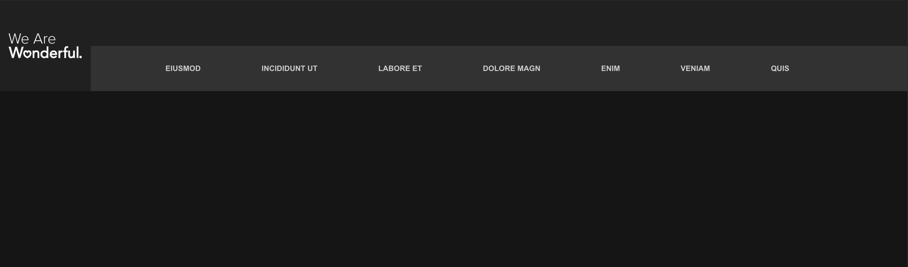
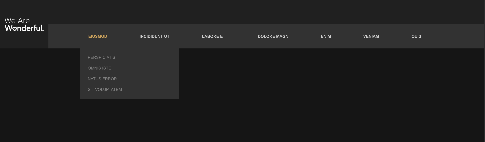
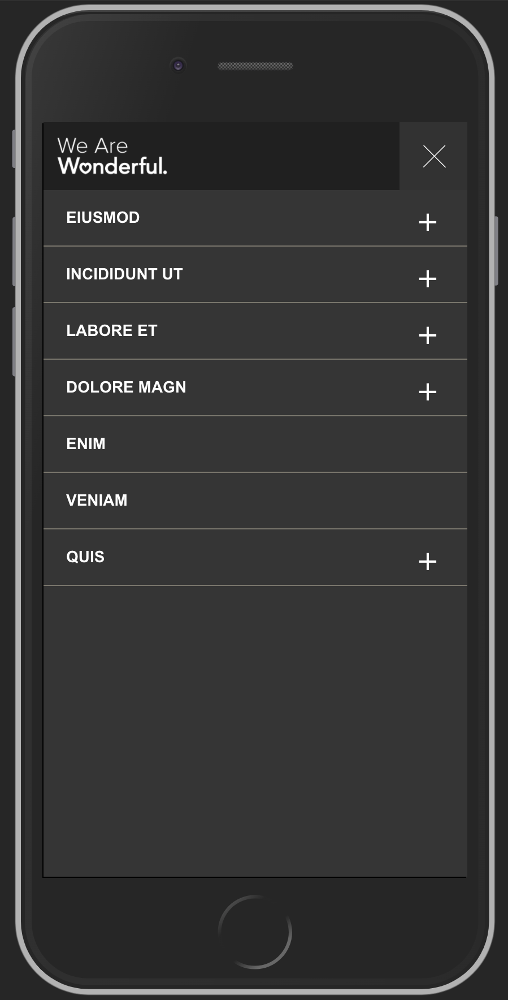
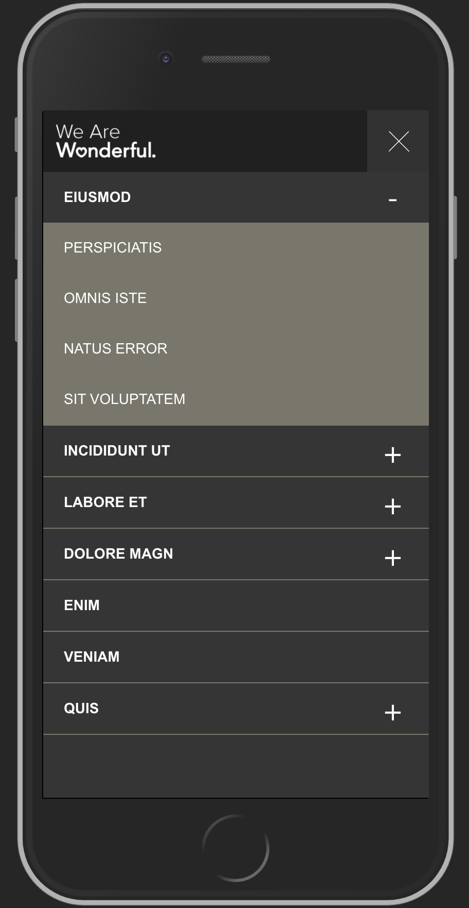

# Front End Skill Assesment

Below you will find an images of a header that contains sub-nav items.  
For desktop, on hover of the parent nav, sub-nav items should appear. For mobile, this will have an expand/collapse feature.  
We'd like you to build it. Sounds simple right? The layout is easy, heck you could pull up bootstrap and knock this out in under an hour. That is a valid approach but it won't get you very far with us.

The point of this Skill Assesment is for you to show us what you believe good development looks like. Are you into polish and visual detail? Refine the design, add some finese. Are you a test finatic? Show us your TDD process. Love data and multi-teir designs? Let us see how you redux. Are you a build ninja? Let see those muscles flexed.

Here are some things we want to see; how you layout your project and what tools you use, how does the project progress, what does your git history look like, and finally how you handle loose requirements - what you bring to the table. Here are some things we value; performance, reproducability, testing, accessibility, multi-channel deliverability ( SEO, Social, Desktop, Mobile, etc...). You should assume the data is seperate than the presentation.

Fork this repo into your github or push it into your prefered git provider and make sure it is open. Fill this otherwise empty repo with goodness. You have 72 hours to submit your completed project.

Good luck.

---

## Assessment Images:
**Desktop - Default**  

**Desktop - Active Subnav**  

**Mobile - Default**  

**Mobile - Active Menu**  

**Mobile - Active Subnav**  

---

## Images

The images from the above are in the directory next to this file. 

---
## Style Guide
**fonts**  
font-family: Arial  
  
**mobile body**  
font-size: 14px  
  
**mobile menu button**  
font-size: 12px  
  
**desktop body**  
font-size: 12px  
  
**Colors**  
white: #ffffff  
black: #000000  
gold: #d1a04f  
beige: #79766b  
dark grey background: #151515  
extra dark grey: #202020  
dark grey: #353535  
medium grey: #323232  
