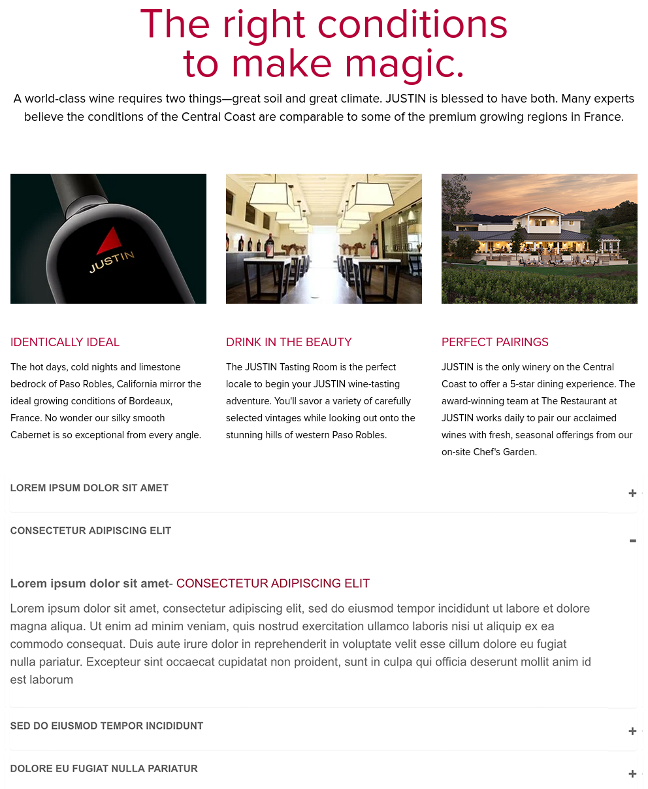

# Front End Skill Assesment

Below you will find an image. We'd like you to build it. Sounds simple right? The layout is easy, heck you could pull up bootstrap and knock this out in 15 minutes. That is a valid approach but it won't get you very far with us.

The accordion is a common/simple feature that can executed via many different approaches, we would like to see what you come up with.

The point of this Skill Assesment is for you to show us what you believe good development looks like. Are you into polish and visual detail? Refine the design, add some finese. Are you a test finatic? Show us your TDD process. Love data and multi-teir designs? Let us see how you redux. Are you a build ninja? Let see those muscles flexed.

Here are some things we want to see; how you layout your project and what tools you use, how does the project progress, what does your git history look like, and finally how you handle loose requirements - what you bring to the table. Here are some things we value; performance, reproducability, testing, accessibility, multi-channel deliverability ( SEO, Social, Desktop, Mobile, etc...). You should assume the data is seperate than the presentation.

Fork this repo into your github or push it into your prefered git provider and make sure it is open. Fill this otherwise empty repo with goodness. You have 72 hours to submit your completed project.

Good luck.

---

### Assessment Image:

---

The images from the above are in the directory next to this file. 

The copy is below.

> The right conditions to make magic.

> A world-class wine requires two things—great soil and great climate. JUSTIN is blessed to have both. Many experts believe the conditions of the Central Coast are comparable to some of the premium growing regions in France.

> Identically Ideal
>
> The hot days, cold nights and limestone bedrock of Paso Robles, California mirror the ideal growing conditions of Bordeaux, France. No wonder our silky smooth Cabernet is so exceptional from every angle.

> Drink in the Beauty
>
> The JUSTIN Tasting Room is the perfect locale to begin your JUSTIN wine-tasting adventure. You'll savor a variety of carefully selected vintages while looking out onto the stunning hills of western Paso Robles.

> Perfect Pairings
>
> JUSTIN is the only winery on the Central Coast to offer a 5-star dining experience. The award-winning team at The Restaurant at JUSTIN works daily to pair our acclaimed wines with fresh, seasonal offerings from our on-site Chef's Garden.
